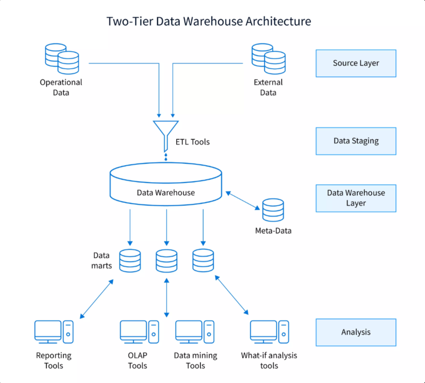
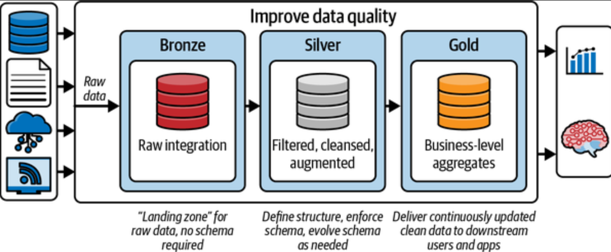

## datawarehouse_sql_project
This project is structured into three main phases:
1. Building the data warehouse
2. Performing advanced SQL-based analysis on the prepared dataset
3. Visualizing the analytical insights using Power BI

We adopted a data warehouse approach, as our data was structured and our primary goal was to build a robust foundation for reporting and business intelligence.Datawarehouse is basically a subject oriented, integrated, time variant and non-volatile cllection of data in support of management's decision making process.

We used the Medallion Architecture to structure our project’s data pipeline.

   
